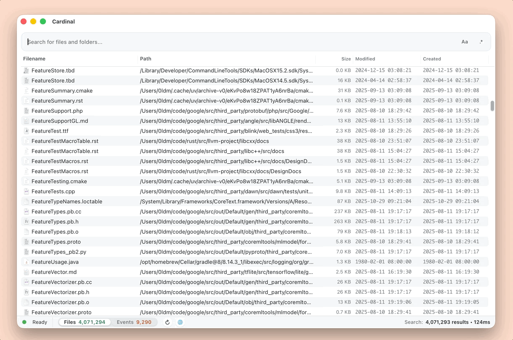

<div align="center">
  
  <h1>Cardinal</h1>
  <p>最快的 macOS 文件搜索工具。</p>
  <p>
    <a href="#使用-cardinal">使用 Cardinal</a> ·
    <a href="#构建-cardinal">构建 Cardinal</a>
  </p>
  
</div>

---

## 使用 Cardinal

### 下载

通过 Homebrew 安装：

```bash
brew install --cask cardinal-search
```

你也可以从 [GitHub Releases](https://github.com/cardisoft/cardinal/releases/) 获取最新的安装包。

### 国际化支持

想切换其他语言？点击状态栏里的 ⚙️ 按钮即可即时切换。

### 基础搜索语法

Cardinal 现在在经典的子串/前缀匹配基础上叠加了 Everything 兼容语法：

- `report draft` – 空格代表 `AND`，只会得到同时包含两个词的文件。
- `*.pdf briefing` – 只显示文件名包含 “briefing” 的 PDF 结果。
- `*.zip size:>100MB` – 查找大于 100MB 的 ZIP 文件。
- `infolder:/Users demo !.psd` – 把搜索范围限制在 `/Users`，然后匹配包含 `demo` 但排除 `.psd` 的文件。
- `tag:ProjectA;ProjectB` – 按 Finder 标签（macOS）过滤；`;` 表示 `OR`（满足任一标签即可）。
- `*.md content:"Bearer "` – 仅筛选包含字符串 `Bearer ` 的 Markdown 文件。
- `"Application Support"` – 使用引号匹配完整短语。
- `brary/Applicat` – 使用 `/` 作为路径分隔符向下匹配子路径，例如 `Library/Application Support`。
- `/report` · `draft/` · `/report/` – 在词首/词尾添加 `/`，分别强制匹配前缀、后缀或精确文件名，补足 Everything 语法之外的整词控制。
- `~/**/.DS_Store` – `**` 会深入所有子目录，在整个家目录中查找散落的 `.DS_Store` 文件。

更多支持的操作符（布尔组合、文件夹限定、扩展名过滤、正则示例等）请参见 [`doc/search-syntax.md`](doc/search-syntax.md)。

### 键盘快捷键与预览

- `Space` – 不离开 Cardinal 即可对当前行执行 Quick Look。
- `Cmd+R` – 在 Finder 中定位选中的结果。
- `Cmd+F` – 焦点回到搜索框。
- `Cmd+C` – 复制所选文件的路径。
- `Cmd+Shift+Space` – 通过全局快捷键开/关 Cardinal 窗口。

祝你搜索愉快！

---

## 构建 Cardinal

### 环境要求

- macOS 12+
- Rust 工具链
- Node.js 18+（附 npm）
- Xcode 命令行工具和 Tauri 依赖（<https://tauri.app/start/prerequisites/>）

### 开发模式

```bash
cd cardinal
npm run tauri dev -- --release --features dev
```

### 生产构建

```bash
cd cardinal
npm run tauri build
```
